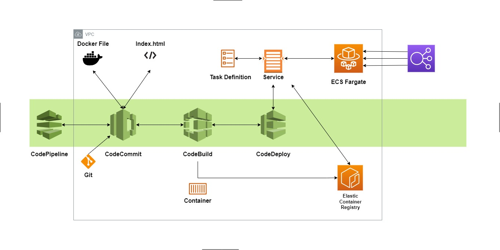

# AWS-CI-CD-CodePipeline
This follows the deployment of a docker container that automatically redeploys the application on every commit to the repository. The container image is stored in an ECR private repository, and this is used by the Fargate cluster to automatically update the deployment. A load balancer was attached to the Fargate cluster to balance the load nd provide health checks



AWS has an implimentaion of creating continuous integration and deployments with their suite of Code* services
- CodePipeline
- CodeDeploy
- CodeBuild
- CodeDeploy

The index file contains html tags for a website. The container is built off of the Docker file which has the instructions on what to build with (the index.html and catimage* files).

CodePipeline integrates all of the elements in a typical code deployment cycle (code, build, test and deploy) and coalesces the services together. Commits are made with Git, setup on your local machine. AWS has provided documentation on <a href = "https://docs.aws.amazon.com/codecommit/latest/userguide/setting-up-ssh-unixes.html"> setting up connection and SSH access to CodeCommit </a>.

The remote repo will be cloned to your local machine using the code below

```
git clone <LINK OF THIS REPO>
```

You'll need to add a buildspec.yml file which CodeBuild needs to crete the Docker container with the images. I've added the buildspec.yml file to this repo, but the excerpt looks like: 

```
version: 0.2

phases:
  pre_build:
	commands:
	  - echo Logging in to Amazon ECR...
	  - aws ecr get-login-password --region $AWS_DEFAULT_REGION | docker login --username AWS --password-stdin $AWS_ACCOUNT_ID.dkr.ecr.$AWS_DEFAULT_REGION.amazonaws.com
	  - REPOSITORY_URI=$AWS_ACCOUNT_ID.dkr.ecr.$AWS_DEFAULT_REGION.amazonaws.com/$IMAGE_REPO_NAME
	  - COMMIT_HASH=$(echo $CODEBUILD_RESOLVED_SOURCE_VERSION | cut -c 1-7)
	  - IMAGE_TAG=${COMMIT_HASH:=latest}
  build:
	commands:
	  - echo Build started on `date`
	  - echo Building the Docker image...          
	  - docker build -t $REPOSITORY_URI:latest .
	  - docker tag $REPOSITORY_URI:latest $REPOSITORY_URI:$IMAGE_TAG    
  post_build:
	commands:
	  - echo Build completed on `date`
	  - echo Pushing the Docker image...
	  - docker push $REPOSITORY_URI:latest
	  - docker push $REPOSITORY_URI:$IMAGE_TAG
	  - echo Writing image definitions file...
	  - printf '[{"name":"%s","imageUri":"%s"}]' "$IMAGE_REPO_NAME" "$REPOSITORY_URI:$IMAGE_TAG" > imagedefinitions.json
artifacts:
  files: imagedefinitions.json
```

Note that you might get an error related to indentation. That is because .yml files don't accept TABS. In your local IDE, highlight the buildspec file and convert all TABS to spaces, then 'git push' to the repo.

CodePipeline will be configured afterwards with CodeCommit as the source provider and CodeBuild for the build stage. CodeDeploy for the deploy stage. 

An IAM role also has to be cretaed for CodeBuild. CodeBuild needs this role to access ECR and send the docker image once its been created.

```
{
  "Statement": [
	{
	  "Action": [
		"ecr:BatchCheckLayerAvailability",
		"ecr:CompleteLayerUpload",
		"ecr:GetAuthorizationToken",
		"ecr:InitiateLayerUpload",
		"ecr:PutImage",
		"ecr:UploadLayerPart"
	  ],
	  "Resource": "*",
	  "Effect": "Allow"
	}
  ],
  "Version": "2012-10-17"
}
```

A Load balancer would bbe attached to the ECS farggate cluster that would be formed

ECS and the fargate cluster also need the <a href = "https://docs.aws.amazon.com/AmazonECS/latest/developerguide/task_execution_IAM_role.html"> ecsTaskExecutionRole </a> attached when you create them. ECS requires this role to be able to make calls to the AWS API on your behalf. This functionality really helps with scaling automatically and reducing admin overhead
